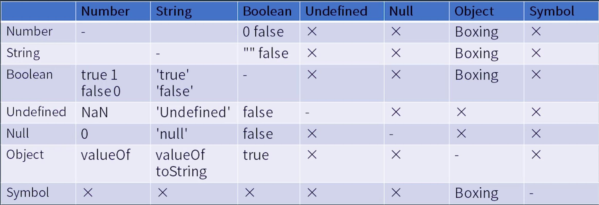
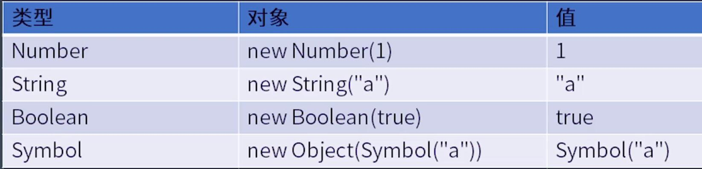

学习笔记
## Expressions
### Member
- a.b    取出来的是一个引用
- a[b]
- foo`string`
- super.b
- super['b']
- new.target
- new Foo()

### Rederence(引用——运行时的设施)标准中的类型
- Object
- Key    string  or  symbol
- delete    删除
- assign    赋值

### Call  函数调用
- foo()
- super()
- foo()['b']      new a()['b']    圆括号应该跟new结合，new的优先级大于call
- foo().b
- foo()`abc`

### Left Handside & Right Handside
- a = c;

- Update
  - a ++
  - a --
  - -- a
  - ++ a

- Unary (单目运算符)
  - delete a.b
  - void foo()
  - typeof a
  - +a
  - -a
  - ~a
  - !a
  - await a

- Exponental
  - ** 右结合的运算符   3 ** 2 ** 2  先算2的2次方，再算3的4次方

- multiplicative
  - */%
- Additive
  - +-

- Shift
  - << >>

- Relationship
  - < > <= >=  instanceof  in

- Equality
  - == 类型不同时会优先把布尔类型的变量转换称Number类型
  - !=

- Bitwise
  - & | !

- Logic
  - &&
  - ||

- Conditional(三目运算符)
  - ？ ：


## Type Convertion   类型转换
- a + b
- "false" == false
- a[o] = 1



### Unboxing(拆箱转换——将Object转成普通的类型)
``` js
var o = {
  toString() { return "2"},
  valueOf() { return 1 },
  [Symbol.toPrimitive]() { return 3 }  // 如果对象中有Symbol.toPrimitive 就会选择它
}
```
### Boxing(装箱转换)


## Statement(语句)
- 简单语句
- 组合语句
- 声明

#### Completion Record(完成记录——存储语句完成的结果)
- [[type]]: noraml, break, continue, return, or throw
- [[value]]: 基本类型
- [[traget]]: label

### 简单语句
- ExpressionStatement
- EmptyStatement
- Debuggerstatement
- ThrowStatement  
- ContinueStatement
- BreakStatement
- ReturnStatement

### 复合语句
- BlockStatement   {}
- IfStatement
- SwitchStatement   在js中用if代替switch
- IterationStatement    循环
- WithStatement
- LabelledStatement   长和IterationStatement一起使用，跳出多层循环
- TryStatement   catch里即使return   finally里的语句也会执行

### 声明
- FunctionDeclaration
- GeneratorDeclaration
- AsyncFunctionDeclaration
- AsyncGeneratorDeclaration
- VariableDeclaration
- classDeclaration
- LexicalDeclaration   let const

#### 作用范围 function body，没有先后关系，永远当作出现在函数的第一行处理
- function，   function * ，  async function ，   async function * ，  var  

#### 在声明前使用会报错
- class,  const,  let

### 预处理
```js
var a = 2;
void function (){
  a = 1;   // 这里的a是return后面声明的a
  return;
  var a;   // 虽然在return后面，但是也会被预处理机制提到最前面
}();
console.log(a);   // 打印 2

var a = 2;
void function (){
  a = 1;   // 这里的a是return后面声明的a，但是在const前使用会报错
  return;
  const a;   // 虽然在return后面，虽然是const，但是也会被预处理机制提到最前面
}();
console.log(a);   // 打印 2
```

### 作用域
var的作用域在函数体，const在block中


## Statement
### Grammar
- 简单语句
- 组合语句
- 声明

### Runtime
- Completion Record
- Lexical Environment

## JS执行粒度（运行时）
- 宏任务
- 微任务（Promise）
- 函数调用（Execution  Context）
- 语句/声明 (Completion  Record)
- 表达式 (Reference)
- 直接量/变量/this

### 事件循环
get code   =>   execute   =>  await

### 函数调用
```js
// foo.js
function foo() {
  console.log(i);
}
export foo;

import { foo } from 'foo.js';
var i = 0;
console.log(i);
foo(); // foo访问的是函数定义的i，如果没有定义就会报错
console.log(i);
i++;
```

#### VariableEnvironment  是个历史遗留包袱，仅用于处理var声明

#### function - Colsure 闭包  每一个函数都会产生一个闭包

#### Realm
- 在JS中，函数表达式和对象直接量均会创建对象
- 使用.做隐式转换也会创建对象
- 这些对象也是有原型的，如果我们没有realm，就不知道他们的原型是什么


