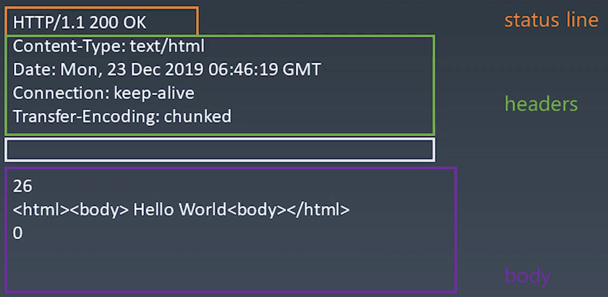

学习笔记
## 浏览器
浏览器的最终目标是把一个URL变成bitmap  
URL(HTTP) =>  HTML(parse)   =>  DOM(css computing)  =>   DOM with CSS(layout)  =>  DOM with position(render)  => bitmap

## 有限状态机
- 每一个状态都是一个机器
  - 在每一个机器里，我们可以做计算、存储、输出
  - 所有的这些机器接受的输入都是一致的
  - 状态机的每一个机器本身没有状态，如果用函数表示的话，他应该是存函数（无副作用）

- 每一个机器知道下一个状态
  - 每个机器有确定的下一个状态(Moore)
  - 每个机器根据输入决定下一个状态(Mealy)

## IOS-OSI七层网络协议
- 应用         HTTP
- 表示         HTTP
- 会话         HTTP
- 传输         TCP
- 网络         Internet
- 数据链路     4G/5G/wifi
- 物理层       4G/5G/wifi

### TCP与IP的一些基础知识
- 流——数据传输没有分割单位，保证数据传输的顺序
- 端口——计算机根据端口把数据包分给各个应用
- require('net')——node中依赖
- 包
- IP地址
- libnet/libpcap——ip层的基础库

### HTTP
- request
- response

一个request对应一个response

